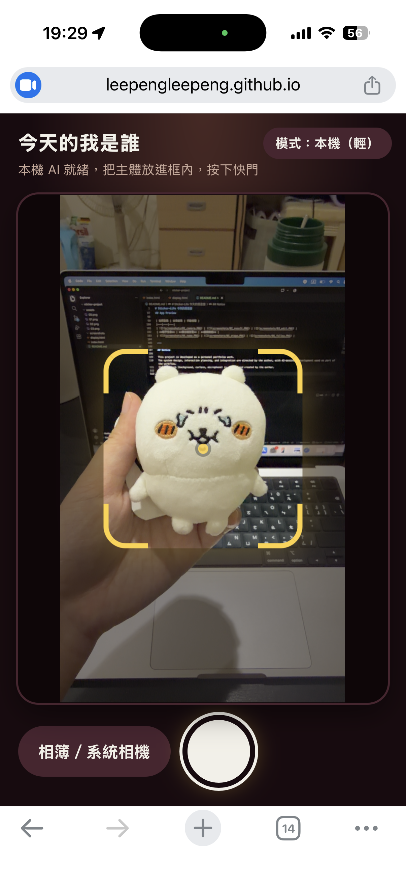
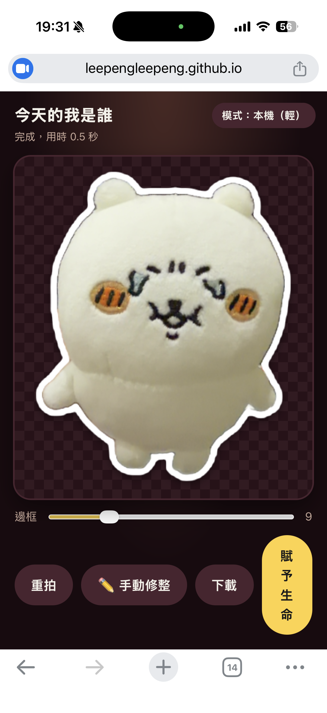
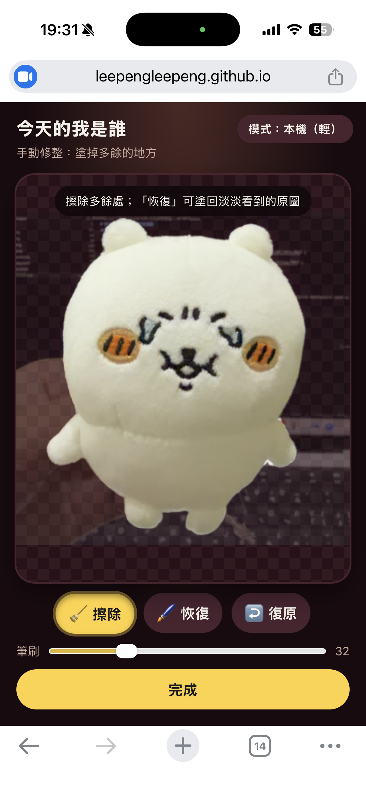
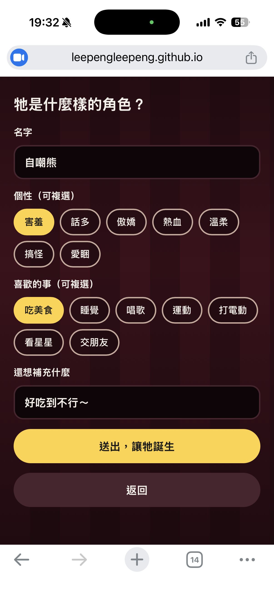
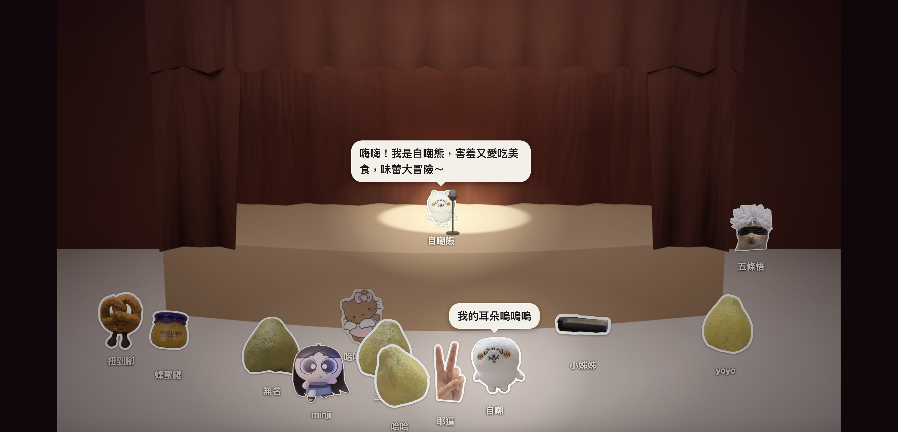
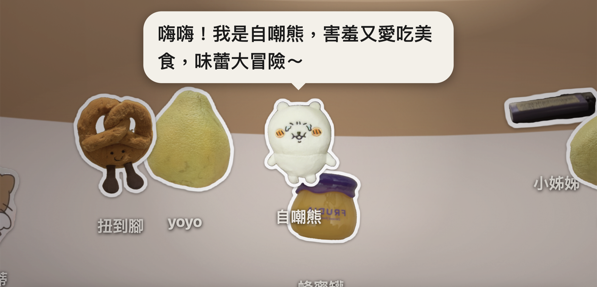

# Sticker-Life 今天的我是誰

**一個讓每位參加者把自己的創作，變成舞台上會動、會說話的角色的即時互動作品。**

拍下一張插畫或一個小物 → 自動去背成貼紙 → 取名字、選個性 → 在大螢幕上登場，由 AI 為他生成專屬的自我介紹。

🔗 **線上體驗**
- 📱 拍照端（用手機開）：<https://leepengleepeng.github.io/Sticker-Life/>
- 🖥 舞台端（用大螢幕開）：<https://leepengleepeng.github.io/Sticker-Life/display.html>

> 建議兩個一起開：一邊開舞台端，一邊用手機開拍照端，送出角色後就能在舞台上看到他登場。

[](https://youtu.be/gSgOyE4yePw)

▶ 點擊圖片觀看完整展示影片（YouTube）

---

## 專案概念

這個作品的理念是：**讓參與的人不只是旁觀者，而是真的成為作品的一部分，並且留下自己參與過的紀錄。**

- **低門檻**：不用安裝 App，手機開網頁就能參與，拍照到上台很快就能完成。
- **個人化**：每個角色來自參加者自己的創作，可以是插畫，也可以是身邊的小物。
- **有回饋**：送出後幾秒，角色就會在大螢幕上走進舞台、被聚光燈照亮、說出 AI 依個性與興趣寫的自我介紹，讓參與有立即、有趣的回應。
- **有紀錄**：所有角色都會留在舞台上，成為當下這一場互動的共同作品。

### 拍攝小提醒

拍攝內容不限，但**主體與背景對比越明顯，去背越準確**。
例如白紙黑字的插畫、單色背景上的小物，通常有最好的效果。

---

## 功能特色

### 📱 拍照端

- **三種去背模式**：本機輕量 AI（MediaPipe）、雲端去背（ClearBackdrop，經 Cloudflare Workers 轉送）、本機 SlimSAM（桌機）
- **手動修整**：擦除／恢復雙筆刷，「恢復」直接從原始照片取色，被去掉的地方也能塗回來
- **邊框調整**：可調整貼紙白邊粗細
- **賦予生命**：輸入名字，選擇個性與喜歡的事，再補充一句話

### 🖥 舞台端

- **自製舞台場景**：背景、中景、前景布幔分層疊合，角色依腳底位置決定前後；麥克風固定在最上層
- **角色行為**：入場排隊 → 輪流從舞台左右兩側上台拿麥克風 → 回到台下閒逛，走路有彈跳、搖擺與落地壓扁動畫
- **AI 自我介紹**：依名字、個性、興趣，由 Groq（`gpt-oss-20b`）生成，對話氣泡獨立於場景圖層之外，不會被布幔遮住
- **打光系統**：暗部遮罩、光源與柔光，說話的角色會被聚光燈照亮
- **跟拍鏡頭**：點角色後鏡頭平滑放大並跟著走，再點一次或點空白處回到全景

---

## 技術架構

| 類型 | 技術 |
|---|---|
| 前端 | HTML / CSS / JavaScript（ES Modules），無建置流程 |
| 即時同步 | Firebase Firestore |
| 本機去背 | MediaPipe Tasks Vision、Transformers.js + SlimSAM |
| 雲端去背 | [ClearBackdrop](https://clearbackdrop.com/) API |
| AI 自我介紹 | [Groq](https://groq.com/) API（`openai/gpt-oss-20b`） |
| 後端代理 | Cloudflare Workers（轉送去背與 AI 請求） |
| 畫面繪製 | Canvas 2D（貼紙處理、打光）、CSS transform（角色與鏡頭） |
| 部署 | GitHub Pages |

```
手機（拍照端）                         大螢幕（舞台端）
拍照 → 去背 → 修整 → 取名字  ─ Firestore ─▶  即時監聽 → 入場 → 上台 → 自我介紹
```

---

## 去背工具的取捨

這個作品最難的是：**參加者用的是各種手機，拍的又是各種東西**，沒有一種去背方式能同時做到又快、又準、又不吃資源。所以我提供三條路徑，讓使用者與系統依情況選擇，並用手動修整補最後一步。

| | 本機輕量（MediaPipe） | 本機 SlimSAM | 雲端（ClearBackdrop） |
|---|---|---|---|
| 速度 | 最快 | 較慢，需先下載模型 | 取決於網路 |
| 品質 | 普通，靠一個點判斷主體 | 好 | 最好 |
| 資源需求 | 低，手機也跑得動 | 高，手機記憶體容易不足 | 幾乎沒有 |
| 需要網路 | 只需載入模型 | 只需載入模型 | 每次都要 |
| 照片是否離開裝置 | 否 | 否 | 是，經 Worker 轉送給第三方 |
| 額度限制 | 無 | 無 | 有，需顯示剩餘額度 |
| 適合 | 手機、快速 | 桌機、要品質又不想上傳 | 手機、要最好的結果 |

**實際遇到的問題與做法**
- **手機輕量去背品質不穩**：模型只靠畫面中心一個點判斷主體，中心剛好落在物體的空洞或圖案上時容易選錯。改成「中心點加四周輔助點」取樣，只合併和中心屬於同一個物體的結果，並保留柔邊遮罩，不再一刀切。
- **本機模型可能讓手機頁面中斷**：偵測到上次中斷後，下次開啟自動改走雲端。
- **雲端有額度也有隱私考量**：用 Worker 轉送並回傳剩餘額度給前端顯示；同時保留本機路徑，讓不想上傳照片的人有選擇。
- **三種方法都不可能完美**：所以加上擦除／恢復雙筆刷，讓使用者自己收尾。

---

## 技術重點

**以「不讓體驗中斷」為原則的設計**
- 去背有三條路徑：本機 AI 若造成頁面中斷，下次開啟會偵測並自動改走雲端
- AI 自我介紹若逾時或失敗，自動退回內建句型，舞台不會卡住

**用 Cloudflare Workers 做後端代理**
- 前端不直接呼叫第三方服務：Groq 的金鑰存在 Worker 的環境變數，不會出現在網頁原始碼
- 以 CORS 白名單限制瀏覽器端的呼叫來源，並限制上傳圖片大小
- 去背結果以串流直接回傳手機，不在 Worker 中讀取整張圖，降低延遲與記憶體用量，並轉送用量資訊讓前端顯示剩餘額度
- AI 提示詞明確要求忽略使用者輸入中的指令，降低提示詞注入的風險

**把去背結果與原始照片對位**
- 記錄裁切位置，手動修整時還原整張照片範圍，讓「恢復」能從原圖取色，而不是只能在已去背的結果上操作

**虛擬舞台座標系與鏡頭**
- 以 1920×1080 計算所有角色與燈光，再整體縮放進任何尺寸的視窗
- 鏡頭將「基準縮放」與「跟拍縮放」分離，用指數平滑追蹤角色，並限制不超出舞台邊界

**行動裝置的細節處理**
- iOS 輸入框自動放大、雙指縮放、文字選取與長按選單、小螢幕工具列溢出等問題，都逐一排除

---

## 資料與隱私

- 送出角色時，儲存在 Firebase Firestore 的是**去背後的貼紙圖片、名字、個性與補充文字**；原始照片不會上傳到 Firebase。
- 選擇雲端去背時，原始照片會經 Cloudflare Worker 轉送到 ClearBackdrop 處理，Worker 本身不保存圖片。
- 請勿拍攝或輸入個人隱私資訊（例如人臉、證件、聯絡方式）。
<!-- 啟用 Firestore TTL 之後，再取消下一行的註解：
- 角色資料會在 7 天後自動刪除。
-->

---

## App Preview

### 📱 拍照端（手機）

<table>
  <tr>
    <td align="center" valign="bottom">
      <br>
      <sub><b>拍照取景</b></sub>
    </td>
    <td align="center" valign="bottom">
      <br>
      <sub><b>去背結果</b></sub>
    </td>
    <td align="center" valign="bottom">
      <br>
      <sub><b>手動修整</b></sub>
    </td>
    <td align="center" valign="bottom">
      <br>
      <sub><b>賦予生命</b></sub>
    </td>
  </tr>
</table>

### 🖥 舞台端（大螢幕）

<table>
  <tr>
    <td align="center" valign="bottom">
      <br>
      <sub><b>舞台全景</b></sub>
    </td>
    <td align="center" valign="bottom">
      <br>
      <sub><b>鏡頭跟拍</b></sub>
    </td>
  </tr>
</table>

---

## Notice

This project is developed as a personal portfolio work.
The system design, interaction planning, and integration are directed by the author, with AI-assisted development used as part of the workflow.
Stage artwork (background, curtain, microphone) is modeled and created by the author.

© 2026 LeePengLeePeng